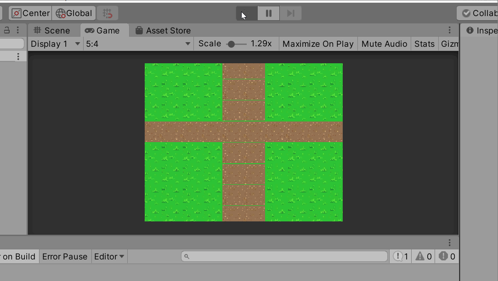
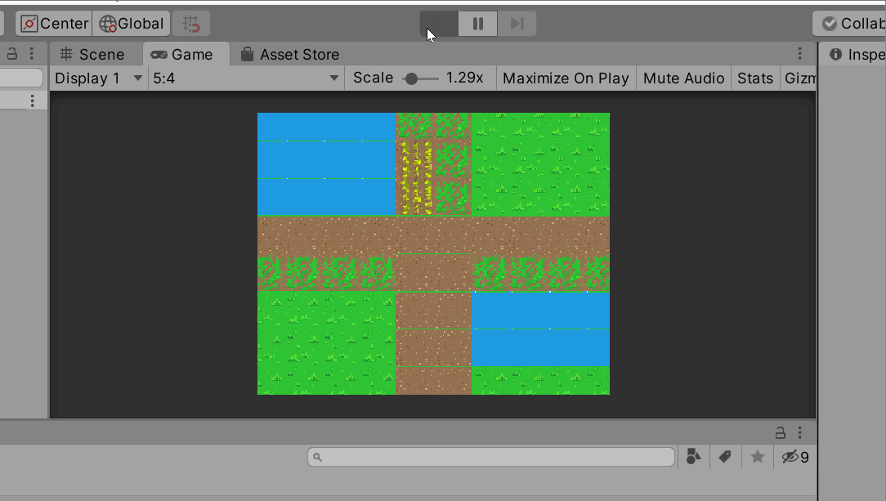

# Milestone 5 Dev Diary - Vanja Venezia #

## Github Commit Comments ##

Apr 7:

Started my attempt at Milestone 5, had been putting it off because I felt like I didn't understand Dijkstra's algorithm well enough to do anything of value.

Was a bit confused at first but after rereading the Milestone brief, I figured out how to proceed.

I've added theoretically all the code I'd need for a base implementation and have cleared nearly all of the errors Unity has thrown.

Cannot test code yet, however, as I am still stuck on one issue in Unity. I am receiving the error "Member 'Vector3Int.up' cannot be accessed with an instance reference; qualify it with a type name instead", seemingly because I'm using the Vector3 commands *.Position.up, *.Position.down, *.Position.left, and *.Position.right methods to reference adjacent tiles to the current tile and apparently they don't play nicely with static instances.

Feeling good about the rest of the code though!

--

Found some flaws in my thinking in the code implementation and realized I'd forgotten to take weight into account (the whole point of the algorithm!).

Added comments to remind myself of my plan to use the Tile Factory to instance adjacent Tiles and check weight, rather than trying to reference them by position only.

--

Apr 8:

Good: Everything now compiles and runs, with the added bonus of NOT creating an infinite loop that crashes Unity.

Bad: Pathfinding does not work or reach destination Tile. I understand that this is based on a flaw in my logic however and intentionally left it until I had the earlier issues I was experiencing solved. Not exactly sure what I need to do but it shouldn't be too hard to debug now that everything runs and doesn't crash

--

Apr 9:

After some debugging and an attempt at a different implementation, I have found what I believe is the cause of my algorithm not working and it appears to be an error in how I'm utilizing the TileFactory. I think that once I get that problem cleared up, my algorithm should mostly work, with some minor adjustments potentially.

--

Apr 10:

made some quick fixes during my check-in with Adam today and then attempted to remove all of my repeat code in favor of iterating through an array and a list. When I iterate through everything though, Unity seems to enter an infinite loop and crash. When I only iterate through position of adjacent tiles (instead of iterating through the positions to make a list of all adjacent tile objects nad then adding those to paths and checking them) my program doesn't crash, however it doesn't find the correct path either.

Not sure what is going wrong since the min heap should be pushing the lowest weight path to the top.

My main thought is that since I'm adding four paths to the min heap every pass of the while loop (until tile with end position is found), the first few paths with the lowest weight are being pushed to the top so the end tile is never actually reached. I think finding some way to check proximity to the end Tile and remove the three least good paths every pass would help to ensure this doesn't happen but I don't have any ideas on how to implement that.

--

Apr 16:

After a few day break away from the project to clear my tunnelvision, today I pulled all my original code out of PathFinder. I copied the design doc steps into PF as comments and then started building up my implementation of the algorithm again. I mostly just copied chunks from my previous version back in and to be honest little changed in my code or it's ordering. One line did change, however, and this time it worked! I realized that the way I was handling the initial popping of a path off the stack was incorrect and instead passing a reference to the now dequeued path, hence all the weird seemingly random pathfinding. My code now says "TilePath current = new TilePath(pathQueue.Dequeue());" which works perfectly. Super happy to see that my implementation WAS actually functional and I do understand Dijkstra's after all. My problem was actually with my understanding of C#, which oddly enough is a big confidence booster as I usually don't struggle with conceptual understandings, especially not graph theory.

--

added gif in case I don't complete advanced functional requirements in time. if I do I will replace this gif with an updated one

--

Added a few more tiles to the TileFactory with varying weights and it works well. The only issue I've noticed is it seems to take longer to handle larger weights, this doesn't really make a whole lot of sense to me. I want water tiles to imply relatively deep water so I gave them a weight of 20; with two or so in a row it works at normal speed, however, trying to pass through too many of them really lags out the pathfinding. It's probably faster when not running live in Unity, but I'd rather not export it to a standalone until it's done.

--

Apr 17:

I tried to add a weight counter for the current path as text but ran into some issues. As such, the update is just to upload an updated gif with different tiles.

## Overall Reflection ##

I was relatively confident coming into this assignment, I felt strongly that I understood the algorithm and had ideas on how to implement it. I ended up struggling a couple times, mostly because I don't understand C# very throroughly, and it kind of put me off the assignment for quite a while. It was weird because I was confident in my implementation but nothing seemed to work; finding out that it was due to not using "new" when popping my "current" TilePath from the stack rather than some flaw in the logic was quite relieving. I had a few other ideas like adding background music, a sound effect for the mouse click, and potentially adding an objects layer but I ran out of time. This assignment was certainly frustrating at times but I feel like I certainly learned (those go hand in hand). Finally seeing it work was exciting, that's probably my favorite part of CS, seeing the result of your time spent conceptualizing and problem-solving.

## Gifs ##

Basic Requirements:

Advanced Requirements:

